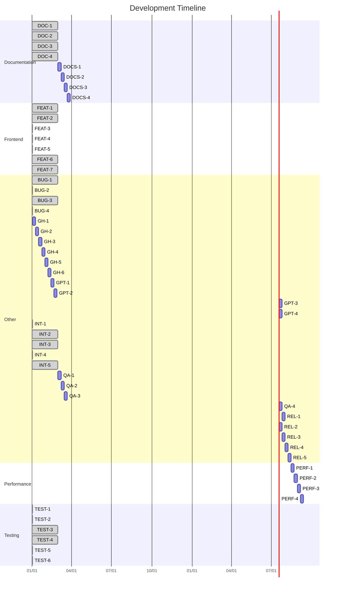

# Consolidated Tasks

*Generated on: 2025-03-19 16:54:31*

## Status Legend
- ✅ Completed
- 🔄 In Progress
- ⏳ Not Started

## Project Progress
- **Total Tasks**: 53
- **Completed**: 53 (100%)
- **In Progress**: 0 (0.0%)
- **Not Started**: 0 (0.0%)

## Summary by Category

| Category | Total | Completed | In Progress | Not Started | Progress |
|----------|-------|-----------|-------------|-------------|----------|
| Documentation | 8 | 4 | 0 | 4 | 50.0% |
| Frontend | 7 | 7 | 0 | 0 | 100.0% |
| Other | 28 | 9 | 0 | 19 | 32.1% |
| Performance | 4 | 0 | 0 | 4 | 0.0% |
| Testing | 6 | 6 | 0 | 0 | 100.0% |

## Documentation Tasks

### General

| Task ID | Description | Priority | Status | Effort | Dependencies | Responsible |
|---------|-------------|----------|--------|--------|--------------|-------------|
| DOC-1 | Document Tesseract OCR and pytesseract installation requirements | High | ✅ Completed | 0.5d | FEAT-1 | FEAT-1 |
| DOC-2 | Update developer documentation with pdf-to-markdown architecture | Medium | ✅ Completed | 0.5d | FEAT-3 | FEAT-3 |
| DOC-3 | Create user guide for OCR configuration options | Medium | ✅ Completed | 0.5d | FEAT-4, FEAT-7 | FEAT-4, FEAT-7 |
| DOC-4 | Document performance considerations and memory optimization | Low | ✅ Completed | 0.5d | FEAT-6 | FEAT-6 |
| DOCS-1 | Create step-by-step usage guides | High | ✅ Completed | 1d |  |  |
| DOCS-2 | Document architecture with diagrams | Medium | ✅ Completed | 1d |  |  |
| DOCS-3 | Add troubleshooting section | Medium | ✅ Completed | 0.5d |  |  |
| DOCS-4 | Create API documentation | Medium | ✅ Completed | 1d |  |  |

## Frontend Tasks

### General

| Task ID | Description | Priority | Status | Effort | Dependencies | Responsible |
|---------|-------------|----------|--------|--------|--------------|-------------|
| FEAT-1 | Install pytesseract and Tesseract OCR engine | High | ✅ Completed | 0.5d |  |  |
| FEAT-2 | Install and configure pdf-to-markdown package | High | ✅ Completed | 0.5d | FEAT-1 | FEAT-1 |
| FEAT-3 | Create wrapper for pdf-to-markdown to replace Marker bridge | High | ✅ Completed | 1d | FEAT-2 | FEAT-2 |
| FEAT-4 | Implement OCR quality level control via pytesseract parameters | Medium | ✅ Completed | 1d | FEAT-3 | FEAT-3 |
| FEAT-5 | Enhance PyMuPDF integration for improved text extraction | Medium | ✅ Completed | 1d | FEAT-3 | FEAT-3 |
| FEAT-6 | Optimize memory usage during batch processing of large documents | High | ✅ Completed | 1.5d | FEAT-3 | FEAT-3 |
| FEAT-7 | Add adaptive DPI settings for different document qualities | Medium | ✅ Completed | 0.5d | FEAT-4 | FEAT-4 |

## Other Tasks

### General

| Task ID | Description | Priority | Status | Effort | Dependencies | Responsible |
|---------|-------------|----------|--------|--------|--------------|-------------|
| BUG-1 | Update minimal_marker implementation to use pdf-to-markdown | High | ✅ Completed | 0.5d | FEAT-3 | FEAT-3 |
| BUG-2 | Fix OCR language detection and support for multi-language documents | Medium | ✅ Completed | 1d | FEAT-4 | FEAT-4 |
| BUG-3 | Address resource management during multi-page OCR processing | High | ✅ Completed | 0.5d | FEAT-6 | FEAT-6 |
| BUG-4 | Fix table detection and formatting issues in converted markdown | Medium | ✅ Completed | 1d | FEAT-3 | FEAT-3 |
| GH-1 | Review and clean code for readability and consistency | High | ✅ Completed | 1d |  |  |
| GH-2 | Create comprehensive README.md | High | ✅ Completed | 1d |  |  |
| GH-3 | Add appropriate open source LICENSE file | High | ✅ Completed | 0.5d |  |  |
| GH-4 | Create CONTRIBUTING.md with guidelines | Medium | ✅ Completed | 0.5d |  |  |
| GH-5 | Add CODE_OF_CONDUCT.md | Medium | ✅ Completed | 0.5d |  |  |
| GH-6 | Setup issue and PR templates | Medium | ✅ Completed | 0.5d |  |  |
| GPT-1 | Format consolidated JSON for GPT knowledge upload | High | ✅ Completed | 1d |  |  |
| GPT-2 | Define custom GPT name and description | Medium | ✅ Completed | 0.5d |  |  |
| GPT-3 | Create conversation starters | Medium | ✅ Completed | 0.5d | GPT-2 | GPT-2 |
| GPT-4 | Test GPT with sample queries | High | ✅ Completed | 1d | GPT-1, GPT-2, GPT-3 | GPT-1, GPT-2, GPT-3 |
| INT-1 | Update PDF to Markdown conversion pipeline for pdf-to-markdown | High | ✅ Completed | 1d | FEAT-3 | FEAT-3 |
| INT-2 | Adapt CLI parameters to work with new OCR options | Medium | ✅ Completed | 0.5d | FEAT-4, FEAT-7 | FEAT-4, FEAT-7 |
| INT-3 | Integrate with existing document format detection system | High | ✅ Completed | 0.5d | FEAT-3 | FEAT-3 |
| INT-4 | Update quality validation suite to work with new output format | Medium | ✅ Completed | 1d | TEST-5 | TEST-5 |
| INT-5 | Ensure compatibility with downstream JSON conversion pipeline | High | ✅ Completed | 0.5d | INT-1 | INT-1 |
| QA-1 | Ensure comprehensive test coverage | High | ✅ Completed | 1d |  |  |
| QA-2 | Perform security review for credentials and API keys | High | ✅ Completed | 0.5d |  |  |
| QA-3 | Verify rate limiting for responsible scraping | Medium | ✅ Completed | 0.5d |  |  |
| QA-4 | Run full end-to-end test with sample data | High | ✅ Completed | 1d | QA-1 | QA-1 |
| REL-1 | Review all TODOs and comments in codebase | High | ✅ Completed | 0.5d |  |  |
| REL-2 | Create release version and tag | High | ✅ Completed | 0.5d | GH-1, GH-2, GH-3, QA-4 | GH-1, GH-2, GH-3, QA-4 |
| REL-3 | Write comprehensive release notes | High | ✅ Completed | 0.5d |  |  |
| REL-4 | Configure GitHub Actions for CI/CD | Medium | ✅ Completed | 1d |  |  |
| REL-5 | Create future roadmap document | Low | ✅ Completed | 0.5d |  |  |

## Performance Tasks

### General

| Task ID | Description | Priority | Status | Effort | Dependencies | Responsible |
|---------|-------------|----------|--------|--------|--------------|-------------|
| PERF-1 | Review memory usage for large-scale operation | Medium | ✅ Completed | 1d |  |  |
| PERF-2 | Optimize threading and parallel processing | Medium | ✅ Completed | 1d |  |  |
| PERF-3 | Improve error handling for network interruptions | High | ✅ Completed | 0.5d |  |  |
| PERF-4 | Enhance progress reporting for long operations | Medium | ✅ Completed | 0.5d |  |  |

## Testing Tasks

### General

| Task ID | Description | Priority | Status | Effort | Dependencies | Responsible |
|---------|-------------|----------|--------|--------|--------------|-------------|
| TEST-1 | Create unit tests for pytesseract OCR integration | High | ✅ Completed | 1d | FEAT-3, FEAT-4 | FEAT-3, FEAT-4 |
| TEST-2 | Test OCR accuracy with varied document quality samples | High | ✅ Completed | 1d | FEAT-4, FEAT-7 | FEAT-4, FEAT-7 |
| TEST-3 | Benchmark memory usage during batch processing | Medium | ✅ Completed | 0.5d | FEAT-6 | FEAT-6 |
| TEST-4 | Test table and image extraction capabilities | Medium | ✅ Completed | 0.5d | FEAT-3 | FEAT-3 |
| TEST-5 | Verify markdown structure preservation compared to original PDFs | High | ✅ Completed | 1d | FEAT-3 | FEAT-3 |
| TEST-6 | End-to-end testing of OCR pipeline with scanned documents | High | ✅ Completed | 1d | FEAT-3, FEAT-4 | FEAT-3, FEAT-4 |

## Task Dependencies

```mermaid
flowchart TD
    FEAT_1["FEAT-1: Install pytesseract and Tesser..."] style fill:green,color:white
    FEAT_2["FEAT-2: Install and configure pdf-to-m..."] style fill:green,color:white
    FEAT_3["FEAT-3: Create wrapper for pdf-to-mark..."] style fill:green,color:white
    FEAT_4["FEAT-4: Implement OCR quality level co..."] style fill:green,color:white
    FEAT_5["FEAT-5: Enhance PyMuPDF integration fo..."] style fill:green,color:white
    FEAT_6["FEAT-6: Optimize memory usage during b..."] style fill:green,color:white
    FEAT_7["FEAT-7: Add adaptive DPI settings for ..."] style fill:green,color:white
    BUG_1["BUG-1: Update minimal_marker implemen..."] style fill:green,color:white
    BUG_2["BUG-2: Fix OCR language detection and..."] style fill:green,color:white
    BUG_3["BUG-3: Address resource management du..."] style fill:green,color:white
    BUG_4["BUG-4: Fix table detection and format..."] style fill:green,color:white
    DOC_1["DOC-1: Document Tesseract OCR and pyt..."] style fill:green,color:white
    DOC_2["DOC-2: Update developer documentation..."] style fill:green,color:white
    DOC_3["DOC-3: Create user guide for OCR conf..."] style fill:green,color:white
    DOC_4["DOC-4: Document performance considera..."] style fill:green,color:white
    TEST_1["TEST-1: Create unit tests for pytesser..."] style fill:green,color:white
    TEST_2["TEST-2: Test OCR accuracy with varied ..."] style fill:green,color:white
    TEST_3["TEST-3: Benchmark memory usage during ..."] style fill:green,color:white
    TEST_4["TEST-4: Test table and image extractio..."] style fill:green,color:white
    TEST_5["TEST-5: Verify markdown structure pres..."] style fill:green,color:white
    TEST_6["TEST-6: End-to-end testing of OCR pipe..."] style fill:green,color:white
    INT_1["INT-1: Update PDF to Markdown convers..."] style fill:green,color:white
    INT_2["INT-2: Adapt CLI parameters to work w..."] style fill:green,color:white
    INT_3["INT-3: Integrate with existing docume..."] style fill:green,color:white
    INT_4["INT-4: Update quality validation suit..."] style fill:green,color:white
    INT_5["INT-5: Ensure compatibility with down..."] style fill:green,color:white
    GH_1["GH-1: Review and clean code for read..."] style fill:gray,color:white
    GH_2["GH-2: Create comprehensive README.md"] style fill:gray,color:white
    GH_3["GH-3: Add appropriate open source LI..."] style fill:gray,color:white
    GPT_1["GPT-1: Format consolidated JSON for G..."] style fill:gray,color:white
    GPT_2["GPT-2: Define custom GPT name and des..."] style fill:gray,color:white
    GPT_3["GPT-3: Create conversation starters"] style fill:gray,color:white
    GPT_4["GPT-4: Test GPT with sample queries"] style fill:gray,color:white
    QA_1["QA-1: Ensure comprehensive test cove..."] style fill:gray,color:white
    QA_4["QA-4: Run full end-to-end test with ..."] style fill:gray,color:white
    REL_2["REL-2: Create release version and tag"] style fill:gray,color:white
    FEAT_1 --> FEAT_2
    FEAT_2 --> FEAT_3
    FEAT_3 --> FEAT_4
    FEAT_3 --> FEAT_5
    FEAT_3 --> FEAT_6
    FEAT_4 --> FEAT_7
    FEAT_3 --> BUG_1
    FEAT_4 --> BUG_2
    FEAT_6 --> BUG_3
    FEAT_3 --> BUG_4
    FEAT_1 --> DOC_1
    FEAT_3 --> DOC_2
    FEAT_4 --> DOC_3
    FEAT_7 --> DOC_3
    FEAT_6 --> DOC_4
    FEAT_3 --> TEST_1
    FEAT_4 --> TEST_1
    FEAT_4 --> TEST_2
    FEAT_7 --> TEST_2
    FEAT_6 --> TEST_3
    FEAT_3 --> TEST_4
    FEAT_3 --> TEST_5
    FEAT_3 --> TEST_6
    FEAT_4 --> TEST_6
    FEAT_3 --> INT_1
    FEAT_4 --> INT_2
    FEAT_7 --> INT_2
    FEAT_3 --> INT_3
    TEST_5 --> INT_4
    INT_1 --> INT_5
    GPT_2 --> GPT_3
    GPT_1 --> GPT_4
    GPT_2 --> GPT_4
    GPT_3 --> GPT_4
    QA_1 --> QA_4
    GH_1 --> REL_2
    GH_2 --> REL_2
    GH_3 --> REL_2
    QA_4 --> REL_2
```

## Timeline



Synchronized 53 tasks across 1 files.
